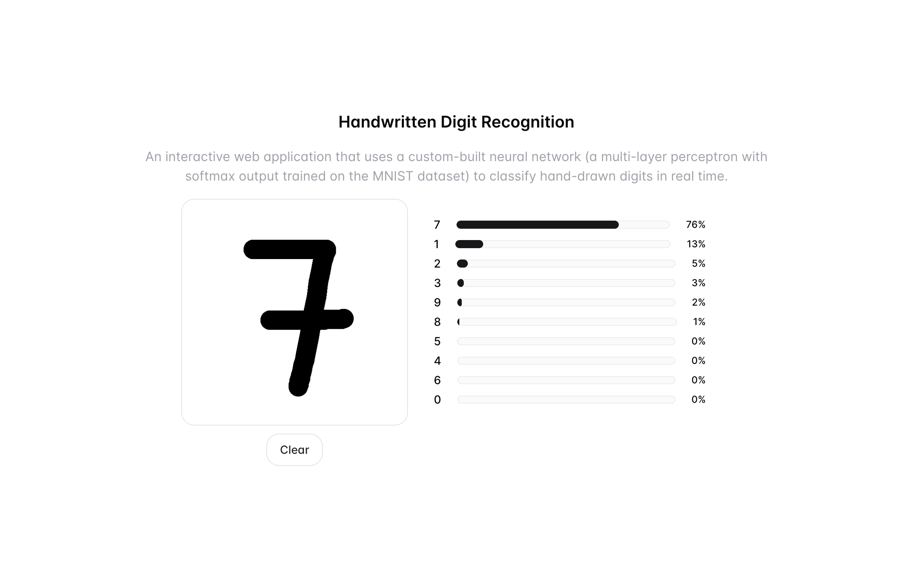

## Handwritten Digit Recognition (MNIST)

An interactive web application for recognizing handwritten digits using a custom, from‑scratch neural network. Draw a digit on the canvas to obtain calibrated class probabilities for digits 0–9 in real time.

### Built on my neural network implementation
This application performs inference using the forward pass and pre‑trained parameters exported from my TypeScript implementation of a multilayer perceptron (trained on MNIST). Training methodology, loss curves, and implementation details are documented in the companion repository: [artkulikovsky/digit-recognition-neural-network](https://github.com/artkulikovsky/digit-recognition-neural-network).

### How it works
- The canvas input is captured and preprocessed to match MNIST conventions (see `src/useCanvasDraw.ts`):
  - Extracts the non‑white bounding box, adds a margin, scales the longest side to 24 px
  - Recenters into a 28×28 canvas by center‑of‑mass alignment
  - Converts to grayscale, inverts (white→0, black→1), and normalizes to [0,1]
- The neural network forward pass (see `src/useNeuralNetwork.ts`, parameters in `src/neural-network-parameters.json`) computes probabilities with numerically stable softmax:
  - a₁ = sigmoid(W₁·a₀ + b₁)
  - a₂ = sigmoid(W₂·a₁ + b₂)
  - a₃ = softmax(W₃·a₂ + b₃), where probabilities sum to 1
  - Softmax uses max‑subtraction for stability.

### Model architecture (from the training repo)
- Input: 784 features (flattened 28×28)
- Hidden Layer 1: 128 neurons, sigmoid activation
- Hidden Layer 2: 64 neurons, sigmoid activation
- Output: 10 neurons, softmax
- Training details: cross‑entropy loss, Xavier init, mini‑batch gradient descent (batch size 128)
 - Parameter shapes: W₁ [128×784], b₁ [128]; W₂ [64×128], b₂ [64]; W₃ [10×64], b₃ [10]
 - Inference notes: deterministic forward pass (no dropout/batch norm); pure TypeScript implementation
 
